

  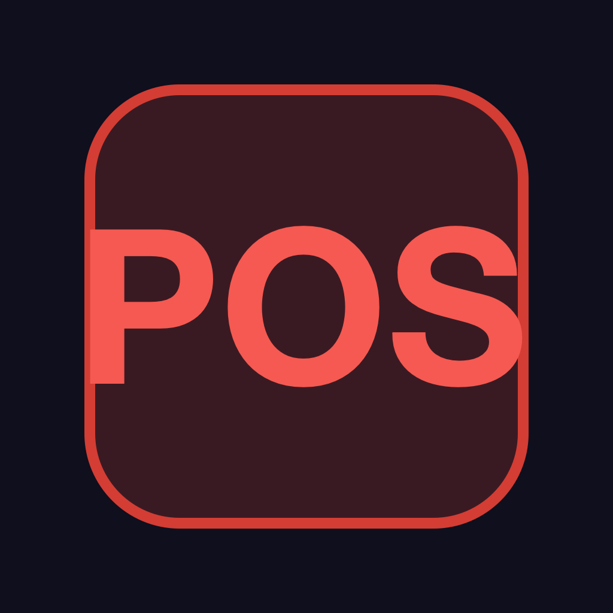

<h1 align="center">火鍋店 POS（iPhone 版）</h1>

專為火鍋店與小型餐廳設計的 iPhone 點餐記帳 App，一支手機就能完成多桌點餐、收款、訂位與每日營業報表。

目前版本：<b>v1.0.1</b>　｜　適用：iPhone（iOS 15 以上，含 iPhone 8）

---

## ✨ 特色

- 🛒 **記帳點餐**：多桌切換、分類選單、長按快速加減數量，一眼看到各桌未結金額。
- 💰 **結帳收款**：明細確認、收款音效；可選擇收款後自動列印收據（藍牙熱感印表機 / AirPrint）或存成 PDF。
- 📅 **訂位管理**：月曆總覽 + 當日時段格線，新增/編輯訂位、標記重要性。
- 🥩 **菜單管理**：自由新增分類與品項、調整價格與順序、暫停供應。
- 🪑 **桌號設定**：自訂桌號、座位數與顯示順序。
- 📊 **銷售報表**：今日/本週/本月/自訂期間，營業額、品項與群組排行（含圓餅圖），可匯出 CSV / PDF 或列印。
- 💾 **資料備份**：手動匯出/匯入、進背景自動備份，資料不怕遺失。
- 🔒 **PIN 碼登入**：4 位數密碼保護，連續錯誤自動鎖定。

---

## 📱 畫面與操作說明

### 登入
啟動後輸入 4 位數 **PIN 碼**。首次使用預設為 **`1234`**，請盡快到「設定 → 修改 PIN 碼」更換。連續輸入錯誤 3 次會鎖定 30 秒。

### 記帳點餐

| 選桌點餐 | 點餐中（長按可連續加減） |
|:---:|:---:|
| 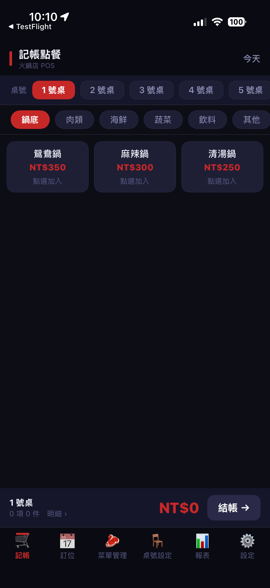 | 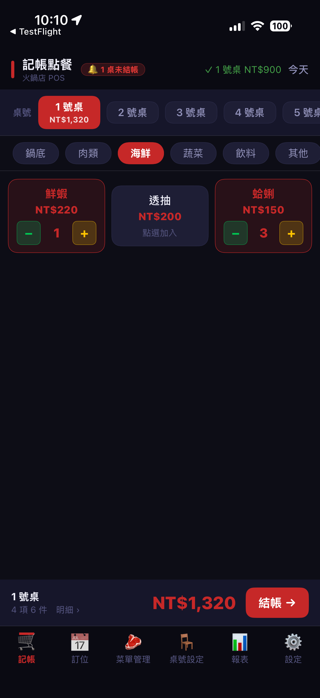 |

1. 上方橫列點選**桌號**（已點餐的桌會顯示紅底與金額）。
2. 中間切換**分類**（鍋底／肉類／海鮮／蔬菜／飲料／其他）。
3. 點品項卡片即可加入；卡片上的 **−／＋** 可調整數量，**長按**會連續快速加減。
4. 下方隨時顯示**合計金額**，點右側「**📋 明細**」按鈕可檢視/刪除品項，按「結帳」進入收款。明細頁右上的「**🗑 取消訂單**」可整單取消（需二次確認）。

> 頂端若出現「🔔 N 桌未結帳」，代表目前有未收款的桌；右上「今天」可切換日期補登過去訂單。

### 結帳收款

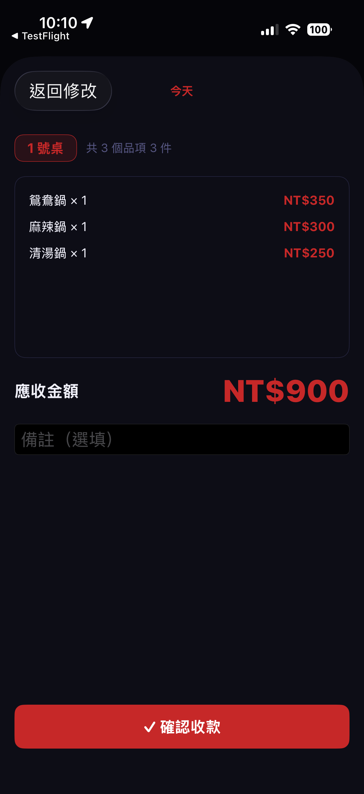

確認桌號、品項與**應收金額**後，可填備註，按「**✓ 確認收款**」完成結帳並播放提示音。若已在設定開啟，會自動列印或存一份收據 PDF。

### 菜單管理

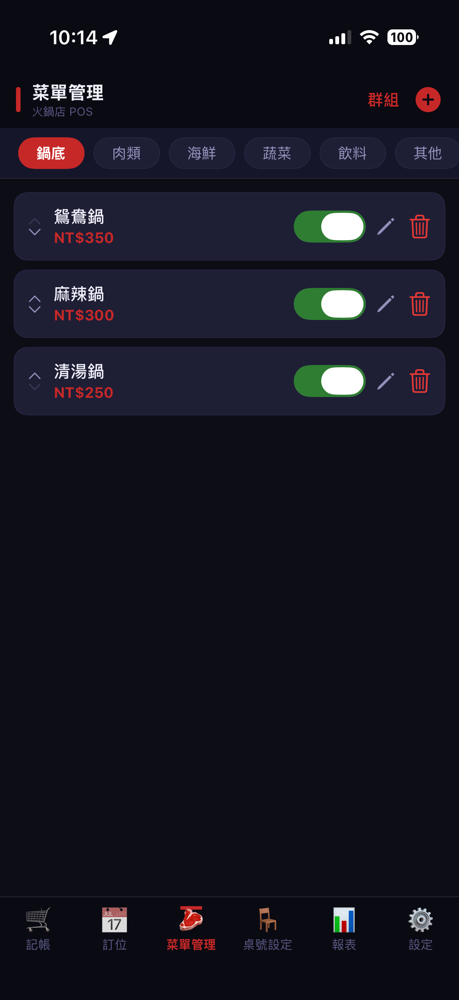

- 右上「**群組**」可新增/排序分類；「**＋**」新增品項。
- 每個品項可用左側箭頭排序、開關供應狀態、編輯價格名稱或刪除。
- 停售的品項不會出現在點餐頁，但歷史訂單仍完整保留。

### 桌號設定

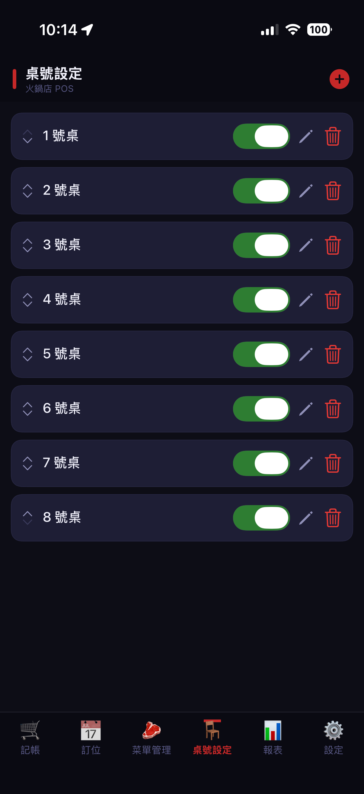

預設提供 1～8 號桌，可新增、改名、設定座位數、調整順序，或暫時停用某桌。

### 訂位管理

月曆可左右滑動切換月份、每日顯示訂位數；點某日進入**當日時段格線**，點空格新增訂位、點方塊編輯（可改桌次、時間、重要性與聯絡資訊）。營業時間與用餐時長可於設定頁調整。

### 報表

| 排行 + 圓餅圖 | 訂單明細 + 匯出 |
|:---:|:---:|
| 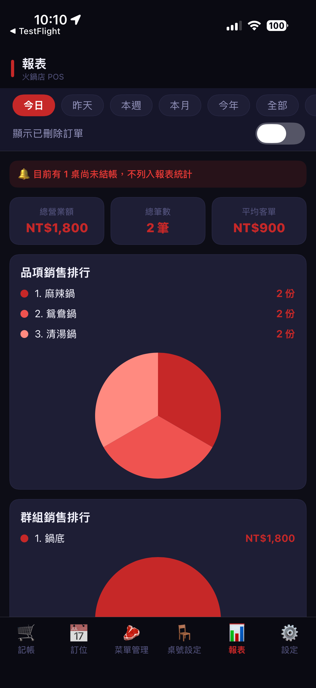 | 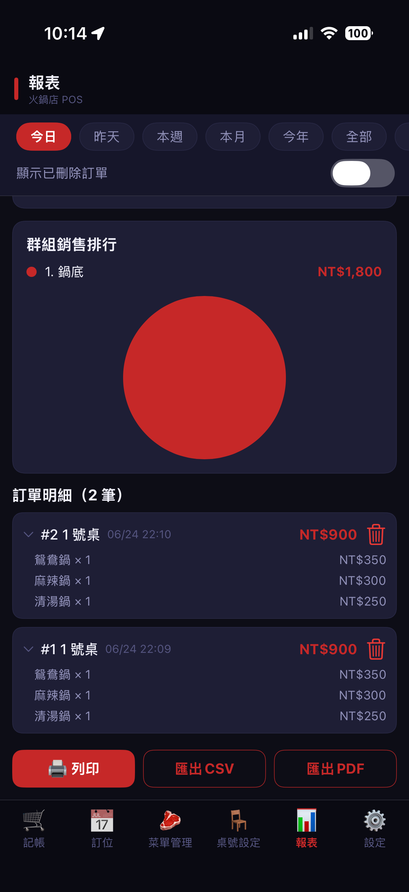 |

- 快速篩選：**今日／昨天／本週／本月／今年／全部／自訂**。
- 三張統計卡：總營業額、總筆數、平均客單。
- **品項銷售排行**與**群組銷售排行**附圓餅圖。
- 訂單明細可展開查看品項，可標記刪除（勾「顯示已刪除訂單」才會列入統計）。
- 底部 **列印**（AirPrint）／**匯出 CSV**／**匯出 PDF**，CSV 用 Excel 開中文不亂碼。

### 設定

| 密碼 / 功能 / 點餐 | 點餐 / 訂位 | 列印 / PDF / 備份 | 自動儲存 / 初始化 |
|:---:|:---:|:---:|:---:|
| 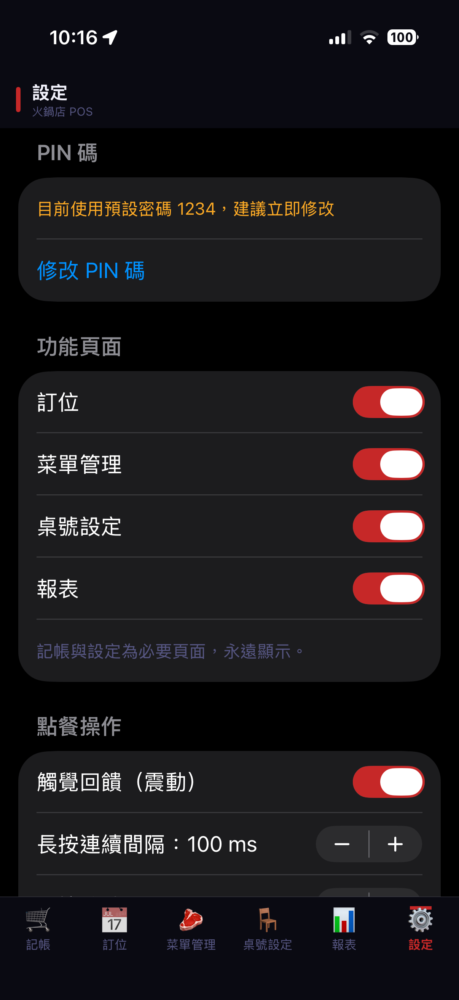 | 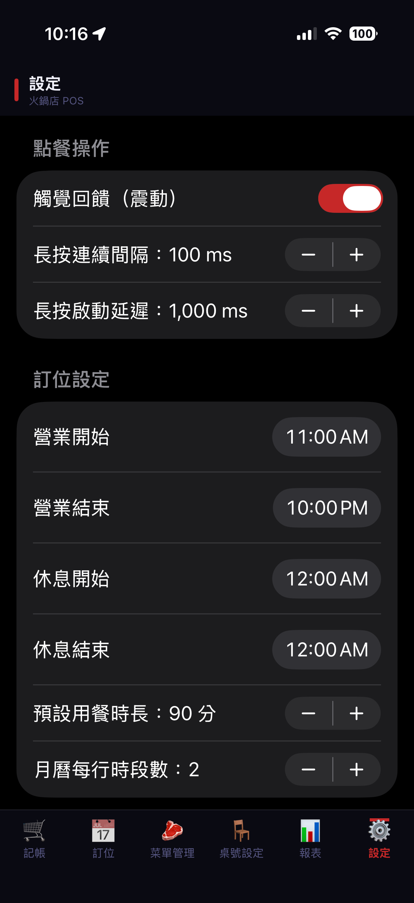 | 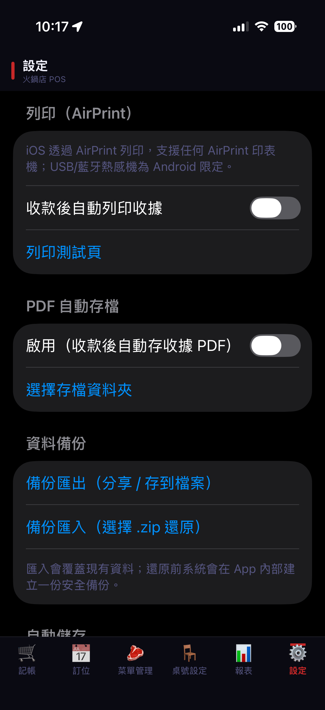 | 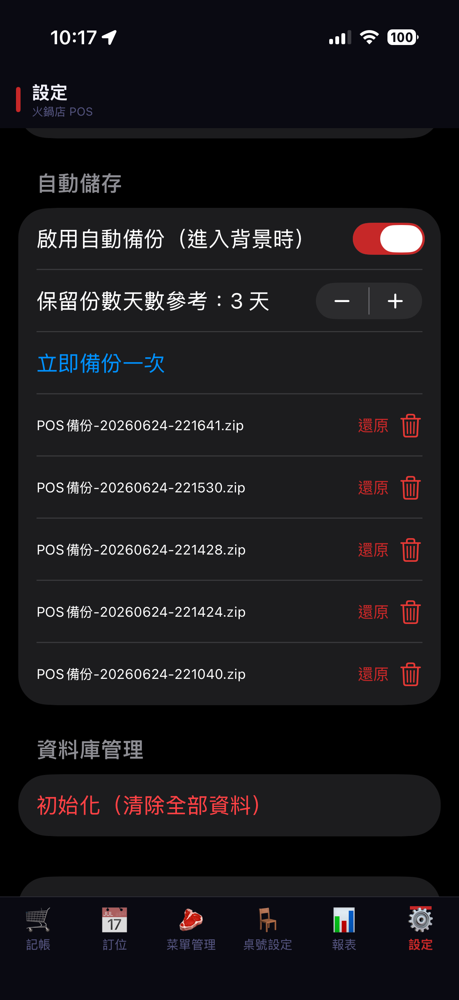 |

| 區塊 | 可調項目 |
|------|---------|
| PIN 碼 | 變更 4 位數登入密碼 |
| 功能頁面 | 個別開關訂位、菜單管理、桌號設定、報表分頁 |
| 點餐操作 | 觸覺回饋（震動）、長按連續加減速度、長按啟動延遲 |
| 訂位設定 | 營業時間、休息時間、預設用餐時長、月曆每行時段數 |
| 熱感印表機（藍牙） | 偵測並連線藍牙熱感印表機（如 XP-Q90EC）、測試列印、記住裝置 |
| 列印（AirPrint） | 收款後自動列印收據、列印測試頁 |
| PDF 自動存檔 | 收款後自動存收據 PDF、指定存檔資料夾 |
| 資料備份 | 手動匯出（分享/存到檔案）、匯入還原（選 .zip） |
| 自動儲存 | 進背景自動備份、保留份數、清單還原/刪除 |
| 資料庫管理 | 初始化（清除全部資料、恢復預設） |

---

## 🚀 首次使用步驟

1. 以預設密碼 **`1234`** 登入。
2. 到「**設定 → 修改 PIN 碼**」改成自己的密碼。
3. 到「**菜單管理**」調整菜單與分類。
4. 到「**桌號設定**」確認桌號。
5. 回「**記帳**」開始為各桌點餐結帳。

---

## 💾 資料備份說明

- **手動備份**：設定 →「資料備份 → 備份匯出」，會打包成 `.zip`，可存到「檔案」App、iCloud 雲碟或用 AirDrop 傳出。
- **還原**：「備份匯入」選擇先前的 `.zip`；匯入會**覆蓋現有資料**，還原前系統會自動先建一份安全備份。
- **自動備份**：App 進入背景時自動備份到內部目錄，可在「自動儲存」清單直接還原或刪除。

> ⚠️ 備份匯入會完整覆蓋目前資料，操作前請先確認已備份最新資料。

---

## 預設資料

首次安裝會自動建立：6 個菜單群組（鍋底/肉類/海鮮/蔬菜/飲料/其他）、17 項範例菜單、1～8 號桌。以上皆可自由修改。

---

## 開發者 / 技術文件

建置、架構、資料庫結構、發佈與 TestFlight 流程請見 **[`DEVELOPER.md`](DEVELOPER.md)**。
本 App 由 Android 版 [`POS_ANDROID_2026`](https://github.com/bjoe0201/POS_ANDROID_2026) 移植，移植計畫見 [`PLANS/PORTING_PLAN.md`](PLANS/PORTING_PLAN.md)。

## 授權

本專案採用 **MIT License**，詳見 [`LICENSE`](LICENSE)。
